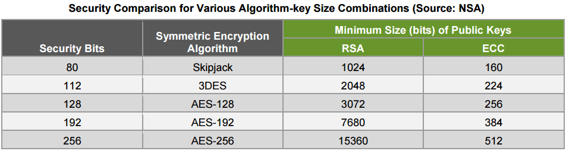
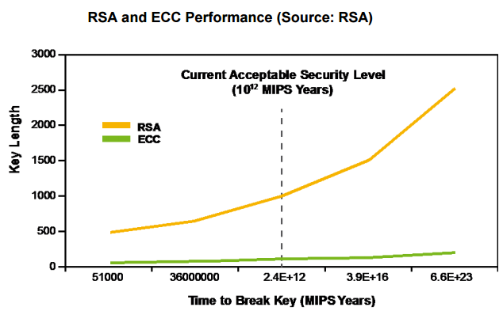

# Elliptic Curve Cryptography (ECC) benchmarks for MCU

Authors: Didier Donsez, Aymeric Brochier, Olivier Alphand.

Status : Draft

## Motivations

[c25519](https://api.riot-os.org/group__pkg__c25519.html) is the default RIOT package used for verifying [SUIT manifests](https://api.riot-os.org/group__sys__suit.html) for FUOTS ([Firmware Update Over The Space](https://github.com/thingsat/Cubedate)), for signing and verifying [XBeacons](https://gricad-gitlab.univ-grenoble-alpes.fr/thingsat/public/-/blob/master/cubesat_mission/messages/lorawan_xbeacon.h) in the [Thingsat cubesat mission](https://gricad-gitlab.univ-grenoble-alpes.fr/thingsat/public/-/tree/master/cubesat_mission).

This benchmarks suite measures the performance of various implementations of ECC algorithms for signing and verifying on various MCU boards. 

## Usual ECC algorithms

| Name | Private Key Size | Public Key Size | Signature Size | [Security Level](https://en.wikipedia.org/wiki/Security_level) |
|------|------------------|-----------------|----------------|----------------|
| [secp112r1](https://neuromancer.sk/std/secg/secp112r1) | 14 bytes | 28 bytes | 28 bytes | |
| [secp128r1](https://neuromancer.sk/std/secg/secp128r1) | 16 bytes | 32 bytes | 32 bytes | |
| [secp160r1](https://neuromancer.sk/std/secg/secp160r1) | 20 bytes | 40 bytes | 40 bytes | 80 bits|
| [secp192r1](https://neuromancer.sk/std/secg/secp192r1) | 24 bytes | 48 bytes | 48 bytes | |
| [secp224r1](https://neuromancer.sk/std/secg/secp224r1) | 28 bytes | 56 bytes | 56 bytes | 112 bits |
| [secp256r1](https://neuromancer.sk/std/secg/secp256r1) | 32 bytes | 64 bytes | 64 bytes | 128 bits |
| [secp256k1](https://neuromancer.sk/std/secg/secp256k1) | 32 bytes | 64 bytes | 64 bytes | 128 bits |
| [ed25519](https://neuromancer.sk/std/other/Ed25519)    | 32 bytes | 64 bytes | 64 bytes | 128 bits |

See https://neuromancer.sk/std/

Security equivalence can be found in Kerry Maletsky, RSA vs. ECC Comparison for Embedded Systems, Microchip, https://ww1.microchip.com/downloads/en/DeviceDoc/00003442A.pdf




## Boards

| Board | MCU | Frequency and DMIPS | RAM | FlashRAM | Support |
|-------|-----|-----------------|-----|----------|---------|
| [Thingsat](https://gricad-gitlab.univ-grenoble-alpes.fr/thingsat/public/-/blob/master/cubesat_mission/README.md#board) | [STM32F405RG](https://www.st.com/en/microcontrollers-microprocessors/stm32f405rg.html) (Cortex M4) | 180 MHz, 210 DMIPS | 192 Kbytes | 1024  Kbytes | RIOT, FreeRTOS, STM32CubeMX |
| Nucleo F466RE | [STM32F446RE](https://www.st.com/resource/en/datasheet/stm32f446re.pdf) (Cortex M4) | 180 MHz, 225 DMIPS |  |   | Arduino, RIOT, MBed, FreeRTOS, STM32CubeMX  |
| Nucleo F103RB | [STM32F103RB](https://www.st.com/en/microcontrollers-microprocessors/stm32f103rb.html) (Cortex M3) | 72 MHz, 90 DMIPS |  |  | Arduino, RIOT, MBed, FreeRTOS, STM32CubeMX |

* DMIPS for Dhrystone 2.1 on STM32 MCU

### Supported by MBed

## Available implementations

### Implementations available in RIOT OS

Implementations are available as packages in [RIOT/pkg directory](https://github.com/RIOT-OS/RIOT/tree/master/pkg).
* [c25519](https://api.riot-os.org/group__pkg__c25519.html) on RIOT OS https://www.dlbeer.co.nz/oss/c25519.html
* [micro-ecc](https://doc.riot-os.org/group__pkg__micro__ecc.html) (uECC_secp160r1) on RIOT OS : https://github.com/kmackay/micro-ecc/blob/master/test/test_ecdsa.c
* monocypher https://monocypher.org/manual 
* qdsa https://www.cs.ru.nl/~jrenes  
* wolfcrypt https://github.com/wolfSSL/wolfssl

Hash functions in RIOT : https://api.riot-os.org/group__sys__hashes__unkeyed.html

### MBed


### Arduino

Highly-optimized ECC implementations for 8-bit AVR processors : WM-ECC, Nano-ECC, MIRACL, RELIC


## Results

* Signing and verifying time in micro-seconds per call

| Board | Algo | Implementation | Message size | Signing | Verifying |
|-------|------|----------------|--------------|---------|-----------|
| Nucleo F466RE |  ED25519   | [c25519](https://api.riot-os.org/group__pkg__c25519.html) | 16 | 298718 | 692123 |
| Nucleo F466RE |  ED25519   | [c25519](https://api.riot-os.org/group__pkg__c25519.html) | 32 | 298720 | 692124 |
| Nucleo F466RE |  ED25519   | [c25519](https://api.riot-os.org/group__pkg__c25519.html) | 128 | 298968 | 692248 |
| Nucleo F466RE |  ED25519   | [c25519](https://api.riot-os.org/group__pkg__c25519.html) | 1024 | 300692 | 693110 |
| Nucleo F103RB |  ED25519   | [c25519](https://api.riot-os.org/group__pkg__c25519.html) | 16 | 1284209 | 2935644 |
| Nucleo F103RB |  ED25519   | [c25519](https://api.riot-os.org/group__pkg__c25519.html) | 32 | 1284219 | 2935649 |
| Nucleo F103RB |  ED25519   | [c25519](https://api.riot-os.org/group__pkg__c25519.html) | 128 | 1284905 | 2935990 |
| Nucleo F103RB |  ED25519   | [c25519](https://api.riot-os.org/group__pkg__c25519.html) | 16 | 1289673 | 2938374 |
| Nucleo F466RE |  secp160r1 | [Micro ECC](https://doc.riot-os.org/group__pkg__micro__ecc.html) | 16 | ?? | ?? |
| Nucleo F466RE |  secp160r1 | [Micro ECC](https://doc.riot-os.org/group__pkg__micro__ecc.html) | 32 | ?? | ?? |
| Nucleo F466RE |  secp160r1 | [Micro ECC](https://doc.riot-os.org/group__pkg__micro__ecc.html) | 128 | ?? | ?? |
| Nucleo F466RE |  secp160r1 | [Micro ECC](https://doc.riot-os.org/group__pkg__micro__ecc.html) | 1024 | ?? | ?? |


## Running the benchmarks suite

### On RIOT


```bash
cd riot/pkg_c25519
gmake BOARD=thingsat-f4 -j 16
gmake BOARD=nucleo-f446re -j 16
gmake BOARD=nucleo-f401re -j 16
gmake BOARD=nucleo-f411re -j 16
gmake BOARD=nucleo-f103rb -j 16
gmake BOARD=nucleo-l073rz -j 16
gmake BOARD=nucleo-l152re -j 16
gmake BOARD=nucleo-l476rg -j 16
gmake BOARD=lora-e5-dev -j 16
gmake BOARD=esp32-wroom-32 -j 16
```

```bash
cd riot/pkg_micro-ecc
gmake BOARD=thingsat-f4 -j 16
gmake BOARD=nucleo-f446re -j 16
gmake BOARD=nucleo-f401re -j 16
gmake BOARD=nucleo-f411re -j 16
gmake BOARD=nucleo-f103rb -j 16
gmake BOARD=nucleo-l073rz -j 16
gmake BOARD=nucleo-l152re -j 16
gmake BOARD=nucleo-l476rg -j 16
gmake BOARD=lora-e5-dev -j 16
gmake BOARD=esp32-wroom-32 -j 16
```

### On MBed

TBD

### On Arduino

TBD

## Annexes

* Kerry Maletsky, RSA vs. ECC Comparison for Embedded Systems, Microchip, https://ww1.microchip.com/downloads/en/DeviceDoc/00003442A.pdf
* G Neven, N. P. Smart and B.Warinschi, Hash function requirements for Schnorr signatures, Jour-
nal of Mathematical Cryptology, vol .3, issue 1, pp. 69-87, 2009.
* Thommas Pornin, Truncated EdDSA/ECDSA Signatures, https://eprint.iacr.org/2022/938.pdf


